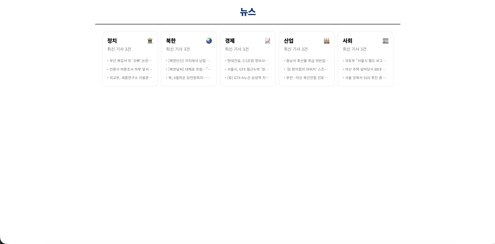
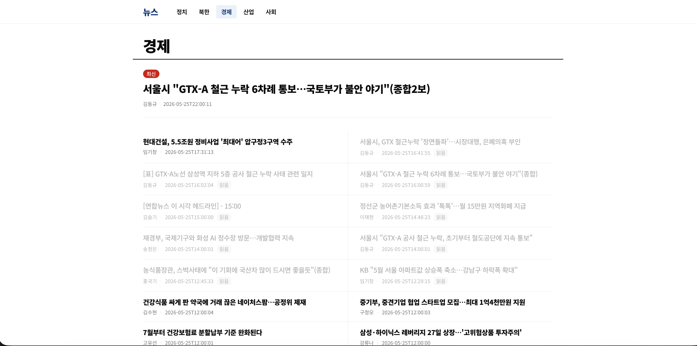
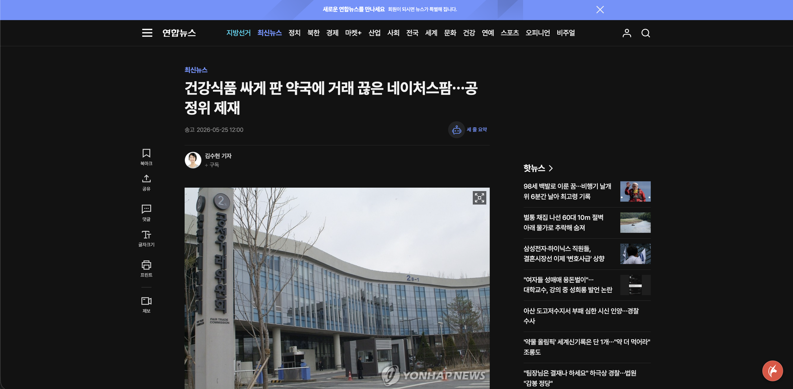
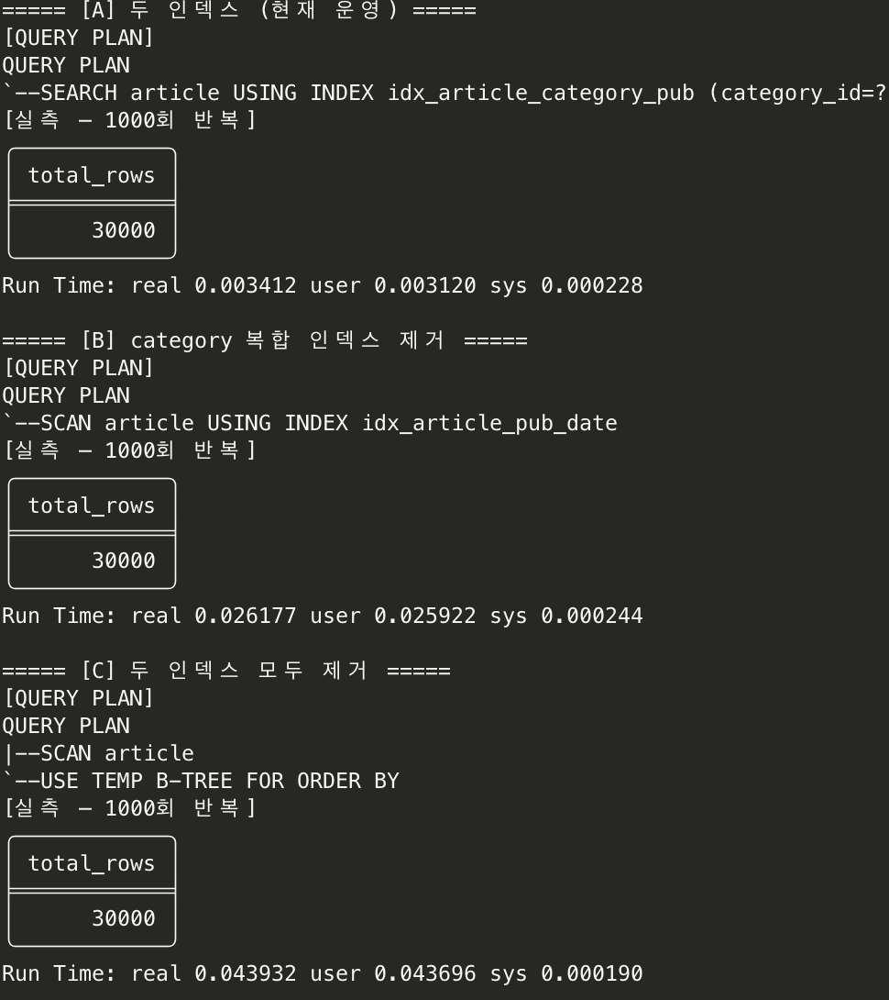
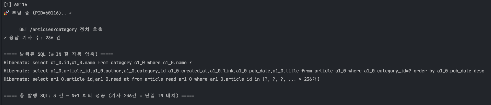
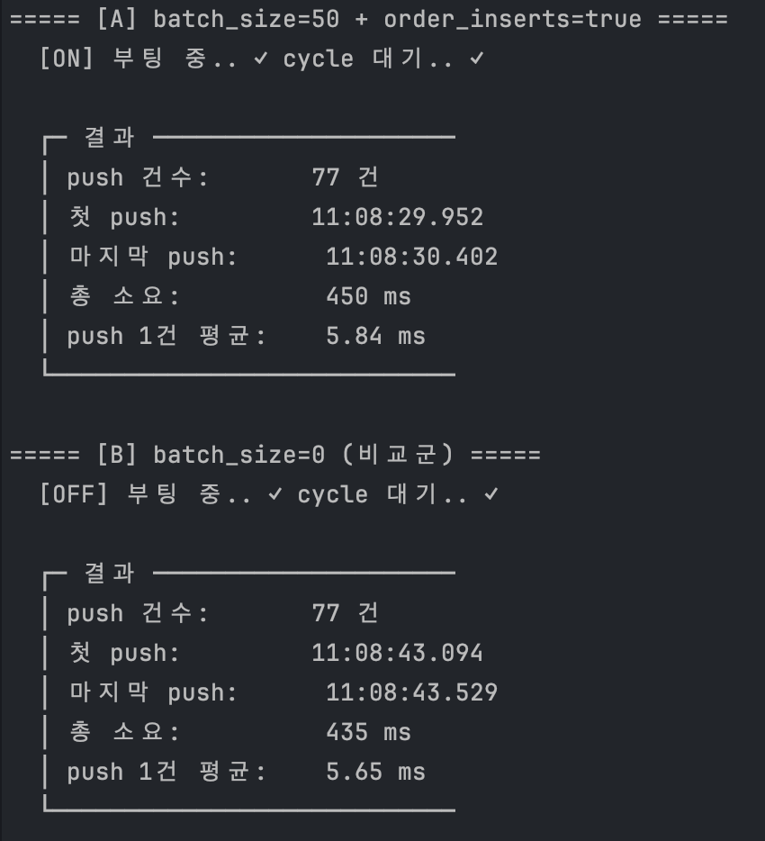

# 뉴스 열람 웹 + 푸시 알림 시스템

사전 과제 1(뉴스 기사 열람 웹) + 과제 2(푸시 알림 백엔드)를 한 프로젝트로 통합 구현. RSS 수집 + `article` 데이터를 두 과제가 공유.

- **프론트엔드**: Next.js — 카테고리별 기사 열람 + 읽음 처리
- **백엔드**: Spring Boot — 10분 주기 RSS 수집 + 100명 사용자에게 카테고리 / 방해금지(DND) 매칭 기반 푸시(시뮬) 발송

---

## AI 도구 활용

| 항목      | 내용                                                                                                 |
| --------- | ---------------------------------------------------------------------------------------------------- |
| 도구      | Claude Code (Anthropic)                                                                              |
| 활용 스킬 | **`superpowers:brainstorming`** (설계 토의) · `systematic-debugging` (이슈 분석)                     |
| 목적      | 설계 토의 · 코드 리뷰 · 리팩토링 · 트레이드오프 분석                                                 |
| 방식      | 페어 프로그래밍 — 모든 설계/구현 의사결정은 응시자 책임. AI 는 제안 / 검토 / 비교 / 문서화 보조 역할 |

---

## 빠른 시작

### 사전 요구사항: JDK 21+, Node.js 20+, pnpm 9+

```bash
# 1. 백엔드 (터미널 1)
cd backend && ./gradlew :app:bootRun

# 2. 프론트엔드 (터미널 2)
cd frontend
pnpm install
pnpm gen:types      # 백엔드 Swagger → TypeScript 타입 자동 생성
pnpm dev
```

| 항목           | URL / 경로                              |
| -------------- | --------------------------------------- |
| 프론트엔드     | <http://localhost:3000>                 |
| 백엔드 Swagger | <http://localhost:8080/swagger-ui.html> |
| DB 파일        | `backend/data/app.db`                   |

### 테스트

```bash
cd backend  && ./gradlew test    # 백엔드 단위 테스트 (앱 종료 상태에서)
cd frontend && pnpm e2e          # 프론트 E2E (Playwright)
```

---

## 스크린샷

### 홈 — 5개 카테고리 카드



### 카테고리 기사 리스트 (읽음 / 미읽음 구분)



### 기사 클릭 — 새 탭으로 외부 원문 오픈



---

## 프로젝트 구조

```
news/
├── backend/
│   ├── core/     도메인 엔티티 + Repository
│   ├── rss/      RSS 수집 (Rome)
│   ├── push/     filter / notification / log / dispatcher
│   └── app/      Spring Boot 엔트리, REST API, 초기화 (Excel 적재)
│
├── frontend/
│   ├── app/          App Router 페이지 + layout / error / loading / not-found
│   ├── components/   ui (shadcn) / layout / home / category
│   ├── lib/          api / types / hooks / actions / constants
│   └── e2e/          Playwright 테스트
│
├── screenshots/  제출용 스크린샷
└── README.md
```

## 기술 스택

| 영역           | 선택                                                                                                     |
| -------------- | -------------------------------------------------------------------------------------------------------- |
| **백엔드**     | Java 21 · Spring Boot 4 · SQLite · Spring Data JPA · Rome (RSS) · Apache POI (Excel) · springdoc-openapi |
| **프론트엔드** | Next.js 16 · TypeScript · React 19 · Tailwind CSS v4 · shadcn/ui · openapi-fetch + openapi-typescript    |
| **테스트**     | JUnit 5 · Mockito · AssertJ · Playwright                                                                 |
| **빌드**       | Gradle 9 (멀티모듈) · pnpm                                                                               |

---

## 과제 1 — 프론트엔드

| 경로               | 설명                                                   |
| ------------------ | ------------------------------------------------------ |
| `/`                | 홈. 5개 카테고리 카드 + 각 카드 최신 기사 3건 미리보기 |
| `/category/{이름}` | 카테고리별 기사 목록. Featured(최신 1건) + 2열 그리드  |

기사 클릭 → **새 탭으로 원문** + 백엔드 읽음 기록(optimistic UI). 새로고침 후에도 읽음 유지.

### 핵심 포인트

1. **ISR + SSG** — 홈 페이지와 카테고리 페이지는 정적 렌더링을 기본으로 하고,
   카테고리 동적 경로는 `generateStaticParams`로 빌드 시 사전 생성.
   `revalidate=600`을 적용해 RSS 수집 주기와 같은 10분 단위의 재검증 기준을 두었음.
   단, ISR 재생성은 캐시 만료 이후 해당 페이지 요청이 들어올 때 수행

2. **타입 안전 API** — 백엔드 DTO 의 `@NotNull` → OpenAPI `required` → `pnpm gen:types` 로 TS 타입 자동 생성. `openapi-fetch` 가 컴파일 타임에 URL/파라미터 오류 검출.

3. **웹접근성 준수** — Skip link, 시멘틱 HTML, ARIA(`aria-label`/`aria-current`), `focus-visible` ring, 색 대비 ≈ 11:1 (AAA), 스크린리더 친화 `sr-only` 텍스트.

4. **읽음 처리** — 클릭 즉시 `useState` optimistic UI + Server Action(`updateTag`)로 카테고리별 cache 정밀 무효화. 새로고침 후에도 isRead 유지.

---

## 과제 2 — 푸시 알림 백엔드

### 동작 흐름

```
RssScheduler (10분 fixedDelay)
   │
   ▼
RssCollectorService.collectAll()
   │
   └─▶ collectOne(카테고리 5개 each, try-catch 격리)
          │
          ① RSS 수집 (Rome) — fetch + 중복 제거 + INSERT
          │
          └─▶ 신규 article 1건마다
                 │
                 ▼
                 PushDispatchService.dispatch(article)
                    ├─ ② 사용자 필터링  — 카테고리 구독자 ∩ DND 미해당
                    ├─ ③ 푸시 발송      — APNS / FCM 시뮬 (success / fail 무작위)
                    └─ ④ 이력 저장      — push_log INSERT (성공 · 실패 모두)
   │
   ▼ (cycle 끝)
cleanupOldArticles — article 1,000건 초과 시 오래된 순 삭제
```

### 각 단계 구체 구현

#### ① RSS 수집 — [`RssCollectorService.collectOne`](backend/rss/src/main/java/com/example/news/rss/service/RssCollectorService.java)

- **Rome 라이브러리** 로 RSS XML → `ArticleDraft` 변환 ([`RssParser`](backend/rss/src/main/java/com/example/news/rss/parser/RssParser.java)). connect 5초 / read 10초 timeout 명시.
- **부분 실패 격리**: 5개 카테고리 each try-catch — 한 피드 fetch / 파싱 실패가 다른 피드 INSERT 에 영향 없음.
- **N+1 회피**: `findAllById(draftIds)` 1쿼리로 기존 `article_id` 일괄 조회 → in-memory `Set` 매칭으로 중복 제거 (§성능1 참고).
- **스케줄링**: [`RssScheduler`](backend/rss/src/main/java/com/example/news/rss/scheduler/RssScheduler.java) `@ConditionalOnProperty` 로 활성화 제어. 부팅 시 `RssInitialFetchRunner` 1회 + 10분 `fixedDelay` 주기.

#### ② 사용자 필터링 — [`UserFilterService`](backend/push/src/main/java/com/example/news/push/filter/UserFilterService.java) + [`DndChecker`](backend/push/src/main/java/com/example/news/push/filter/DndChecker.java)

- **카테고리 매칭**: `userCategoryRepository.findById_CategoryId(article.categoryId)` → 해당 카테고리 구독자 `user_id` 리스트 → `userRepository.findAllById(...)` 로 사용자 객체 일괄 로드.
- **DND 판정** ([정책 표 참고](#dnd-방해금지-시간-룰)):
  - `dndStart == null && dndEnd == null` → 미설정 (Excel `"-"`) → 항상 발송 허용
  - `start <= end` → 일반 구간 `[start, end]` — `!now.isBefore(start) && !now.isAfter(end)` 시 차단
  - `start > end` → 자정 넘김 `[start, 24:00) ∪ [00:00, end]` — `!now.isBefore(start) || !now.isAfter(end)` 시 차단
- 두 조건 모두 만족 (구독자 AND DND 미해당) 하는 사용자만 dispatch 대상으로 반환.

#### ③ 푸시 발송 — [`PushDispatchService`](backend/push/src/main/java/com/example/news/push/dispatcher/PushDispatchService.java) → [`PushNotificationServiceImpl`](backend/push/src/main/java/com/example/news/push/notification/PushNotificationServiceImpl.java)

- 사용자 `push_type` 으로 발송 메서드 분기:
  `switch { case "APNS" → sendAPNS; case "FCM" → sendFCM; default → "fail" }`
- 인터페이스 / 시뮬 구현체는 **요구사항 §4-3 의 코드를 그대로 사용** — 실제 APNS / FCM 호출 안 함, `random.nextBoolean()` 으로 `"success"` / `"fail"` 무작위 반환.
- Excel `push_type` 컬럼은 `"APNs"` / `"FCM"` 인데, `UserDataInitializer` 가 `.toUpperCase()` 로 `"APNS"` / `"FCM"` 정규화 후 저장 → switch 일관성 보장.

#### ④ 발송 이력 저장 — [`PushLogRecorder`](backend/push/src/main/java/com/example/news/push/log/PushLogRecorder.java)

- 1발송 = 1행. **요구사항 §4-4 의 6필드 모두 저장**: `device_id`, `push_type`, `article_id`, `title`, `category`, `sent_at`, `status`.
- **성공 · 실패 모두 기록** — 운영 시 에러율 / 대상자 추이 분석 가능.
- **`title`, `category` 를 비정규화하여 텍스트로 직접 저장** — article 이 1,000건 cleanup 으로 삭제돼도 이력은 보존되어야 하기 때문. push_log 단독 조회 가능, article 과 JOIN 불필요.

#### 오케스트레이션 — article-by-article dispatch

신규 article INSERT 직후 같은 루프 안에서 즉시 `pushDispatchService.dispatch(...)` 호출. `dispatch` 자체에 `@Transactional` 이 있어 **push 실패가 article INSERT 를 롤백시키지 않음**. 한 article 의 push 발송이 실패해도 다음 article 처리 계속 진행.

### DND (방해금지) 시간 룰

| `dnd_time` 값 | 의미                                           |
| ------------- | ---------------------------------------------- |
| `-`           | 미설정 → 항상 발송                             |
| `09:00-18:00` | 같은 날 09:00 ~ 18:00 발송 제외                |
| `23:00-11:00` | **자정 넘김** — 당일 23:00 ~ 다음날 11:00 제외 |

경계값 정책: **양쪽 포함** `[start, end]` — 시작/종료 시각 모두 차단. `start > end` 면 자정 넘김 구간으로 해석.

### 데이터 모델

| 테이블          | 역할                                | PK                                                |
| --------------- | ----------------------------------- | ------------------------------------------------- |
| `category`      | 카테고리 (정치/북한/경제/산업/사회) | `id` (autoincrement)                              |
| `users`         | 사용자 100명 (Excel 적재)           | `id` (Excel No 그대로)                            |
| `user_category` | 사용자-카테고리 다대다 매핑         | `(user_id, category_id)`                          |
| `article`       | RSS 기사 (최대 1,000건)             | `article_id` (자연키 — RSS link 의 `AKR...` 부분) |
| `article_read`  | 기사 읽음 상태 (단일 사용자 가정)   | `article_id`                                      |
| `push_log`      | 푸시 발송 이력 (FK 없이 비정규화)   | `id` (autoincrement)                              |

전체 DDL / 인덱스 → [`backend/app/src/main/resources/schema.sql`](backend/app/src/main/resources/schema.sql)

### Spring Boot 4 부팅 — `schema.sql` 3종 세트

```properties
spring.jpa.hibernate.ddl-auto=none
spring.sql.init.mode=always
```

JPA + schema.sql 조합에서 부팅 순서 보장. 하나라도 빠지면 `no such table` 에러.

---

## 성능 / 캐시 — 의사결정과 트레이드오프

각 항목 모두 **"고려한 옵션 → 트레이드오프 → 최종 선택과 근거"** 흐름.

### 1. RSS 신규 기사 중복 체크 — N+1 회피

매 cycle 마다 30개 draft 가 article 테이블에 이미 있는지 확인 필요.

| 옵션                                           | 쿼리 수   | 트레이드오프                                                               |
| ---------------------------------------------- | --------- | -------------------------------------------------------------------------- |
| (A) `existsById` 루프 N회                      | N         | 가장 단순. 카테고리당 30회 × 5 = 150 쿼리/cycle                            |
| **(B) `findAllById(draftIds)` 1회 + Set 매칭** | **1**     | **쿼리 1회, in-memory 비교**. IN 절 한계는 30개 규모에선 무의미            |
| (C) DB UPSERT (`INSERT OR IGNORE`)             | 1 (write) | 가장 적은 라운드트립. 단 **신규/기존 구분이 사라져 푸시 트리거 분기 불가** |

→ 푸시는 "신규 기사" 만 대상이라 INSERT 결과 구분이 필수.

### 2. article 1,000건 초과 cleanup — 엔티티 로드 회피

| 옵션                                                            | 쿼리                | 트레이드오프                                                                         |
| --------------------------------------------------------------- | ------------------- | ------------------------------------------------------------------------------------ |
| (A) `findAllByOrderByPubDateAsc(Pageable)` + `deleteAllInBatch` | SELECT 1 + DELETE 1 | 삭제 대상 엔티티를 PersistenceContext 에 일단 로드                                   |
| (B) native `DELETE … WHERE article_id IN (SELECT … LIMIT n)`    | DELETE 1            | 엔티티 로드 회피. 단 **DB 종속(`LIMIT` 문법)** + CLAUDE.md JPA 우선순위 위배         |
| **(C) derived + Pageable**                                      | SELECT 1 + DELETE 1 | A 와 동일. cleanup 빈도(10분 1회) × 규모(< 30 row) 가 native 의 마이크로 이득을 상쇄 |

→ JPA 우선순위 `derived > JPQL > native` 원칙 준수

### 3. article 인덱스 전략

| 옵션                                    | 인덱스            | 사용처                                              |
| --------------------------------------- | ----------------- | --------------------------------------------------- |
| (A) `pub_date` 단일                     | cleanup 정렬      | 카테고리 조회는 풀스캔                              |
| (B) `(category_id, pub_date DESC)` 복합 | 카테고리별 최신순 | cleanup 정렬 인덱스 미사용                          |
| **(C) 둘 다**                           | A + B             | 약간의 write 비용 ↑, **두 핫패스 모두 인덱스 스캔** |

→ write 가 10분에 ~30 row 라 추가 인덱스 비용 미미. cleanup 과 카테고리 조회 둘 다 핫패스라 양쪽 인덱스 보유가 합리적.

#### 실측 — EXPLAIN QUERY PLAN + wall-clock (1000회 반복, 756건 article)

| 케이스                          | QUERY PLAN                                                            | Run Time (real) | 비율       |
| ------------------------------- | --------------------------------------------------------------------- | --------------- | ---------- |
| **두 인덱스 (현재 운영)**       | `SEARCH article USING INDEX idx_article_category_pub (category_id=?)` | **3.4 ms**      | **1×**     |
| `idx_article_category_pub` 제거 | `SCAN article USING INDEX idx_article_pub_date`                       | 26.2 ms         | 7.7× 느림  |
| 인덱스 전무                     | `SCAN article` + `USE TEMP B-TREE FOR ORDER BY`                       | 43.9 ms         | 12.9× 느림 |



> 테스트 방법: DB 복사본에서 인덱스를 단계적으로 DROP 후 같은 카테고리 조회 쿼리 1000회 반복, `sqlite3 .timer on` 으로 wall-clock 측정.

### 4. 카테고리 페이지 응답에 `isRead` 채우기 — 또 다른 N+1

`GET /articles?category=…` 응답에 기사마다 `isRead` 필드 필요.

| 옵션                                         | 쿼리 수 | 단점                                               |
| -------------------------------------------- | ------- | -------------------------------------------------- |
| (A) 기사마다 `existsById(articleId)`         | N       | 정확히 N+1. 200건 = 200쿼리                        |
| (B) `articleReadRepository.findAll()` → Set  | 1       | **전체 읽음 데이터 로드** — 누적 시 메모리 압박    |
| **(C) `findAllById(articleIds)` → Set 매칭** | **1**   | 해당 카테고리 articleId 만 정확히 IN — 메모리 효율 |

→ 단일 사용자 가정이라 article_read 가 작아도, 패턴 자체가 **스케일 가능한 N+1 회피의 정석**.

#### 실측 — `GET /articles?category=정치` 발행 SQL

236건 응답에 **단 3 쿼리** (카테고리 lookup + article 목록 + article_read IN 1회). N+1 (A안) 이었다면 1 + 1 + 236 = **238 쿼리** (약 79배 차이).



> 테스트 방법: `spring.jpa.show-sql=true` 로 부팅 후 `curl /articles?category=정치` 1회 호출, Hibernate 콘솔 로그에서 발행 SQL 카운트 (IN 절은 가독성 위해 자동 압축).

### 5. `@Scheduled` — `fixedRate` vs `fixedDelay`

| 옵션                 | 동작                              | 위험                                                                          |
| -------------------- | --------------------------------- | ----------------------------------------------------------------------------- |
| (A) `fixedRate`      | 시작 시각 기준 10분마다 강제 실행 | 한 cycle 이 10분을 넘기면 **누락 catch-up 동시 발생** → 외부 RSS 서버에 burst |
| **(B) `fixedDelay`** | 이전 cycle 종료 후 10분 대기      | catch-up 없음 · 외부 서버에 정중 · pool size 변동에도 단일 실행 보장          |

→ 외부 HTTP fetch + 푸시 dispatch 가 포함되어 cycle 시간 변동성이 있음.

### 6. Hibernate `batch_size` — 검토 후 제거

푸시 발송 시 `push_log` 는 사용자당 1행 INSERT (한 기사로 최대 100건이 같은 트랜잭션). 처음엔 `batch_size=50` 으로 묶어 성능 이득을 기대했지만 실측 효과가 없어 옵션을 제거하고 **단건 INSERT** 로 결정했습니다.

| 케이스                 | 76건 push 총 소요 | 1건당   |
| ---------------------- | ----------------- | ------- |
| batch_size=50          | 559 ms            | 7.36 ms |
| **단건 INSERT (현재)** | 545 ms            | 7.17 ms |

→ SQLite (in-process) 는 JDBC 호출이 함수 호출 수준이라 묶을 라운드트립이 없음. PG / MySQL 같은 원격 DB 로 마이그레이션 시점에 다시 도입 검토가 적절.



> 테스트 방법: `batch_size=50` / `batch_size=0` 두 properties 로 각각 부팅 → 첫 RSS cycle 의 push wall-clock 비교 (동일 article 76건 기준).

### 7. 읽음 처리 후 Next.js ISR 캐시 무효화 — 폭/정확도

ISR 캐시(`revalidate=600`) 가 살아있는 동안엔 새로고침 후 `isRead` 가 반영 안 됨. 정밀 무효화 필요.

| 옵션                                             | 무효화 범위               | 문제점                                         |
| ------------------------------------------------ | ------------------------- | ---------------------------------------------- |
| (A) `revalidatePath("/category/[name]", "page")` | 카테고리 페이지 5장 전부  | 클릭과 무관한 다른 카테고리 캐시까지 같이 폐기 |
| (B) `revalidatePath('/category/' + name)`        | 클릭한 카테고리 1장       | **한국어 path("/category/정치") 매칭 불안정**  |
| **(C) `updateTag('articles:' + name)`**          | 해당 카테고리 fetch 1건만 | `next.tags` 선언 필요. **가장 정밀**           |

→ path 매칭 실패 케이스를 발견한 뒤 fetch tag 방식으로 우회.

※ Next.js 16부터 `revalidateTag(tag, profile)` 2-arg 필수. Server Action 안에서는 즉시 만료 + read-your-own-writes semantics를 보장하는 신규 API `updateTag` 사용.

### 8. 프론트엔드 렌더링 전략

| 옵션                           | 첫 로딩              | 콘텐츠 최신성               | SEO  | 운영 비용              |
| ------------------------------ | -------------------- | --------------------------- | ---- | ---------------------- |
| (A) CSR (`useEffect` fetch)    | 느림                 | 항상 최신                   | 낮음 | 0                      |
| (B) SSR (매 요청 fetch)        | 보통                 | 항상 최신                   | 높음 | 요청마다 백엔드 호출   |
| **(C) ISR (`revalidate=600`)** | **빠름 (정적 HTML)** | 10분 stale-while-revalidate | 높음 | 10분당 1회 백엔드 호출 |
| (D) full SSG                   | 가장 빠름            | 빌드 시점 고정              | 높음 | RSS 갱신마다 재빌드    |

→ RSS 수집 주기와 동일한 재검증 간격을 설정해 최대 stale 시간을 제한.

---

## DB 파일 확인

| 항목                                     | 경로                               |
| ---------------------------------------- | ---------------------------------- |
| DB 파일 (SQLite)                         | `backend/data/app.db`              |
| 테이블별 CSV (열기 편하도록 사전 export) | `backend/data/exports/{table}.csv` |

### SQLite CLI 로 직접 조회

```bash
sqlite3 backend/data/app.db
```

#### `category` — 카테고리 5개

```sql
SELECT * FROM category;
```

#### `users` — 사용자 100명

```sql
-- 일부 확인
SELECT * FROM users LIMIT 5;

```

#### `user_category` — 사용자-카테고리 다대다 매핑

```sql
-- 카테고리별 구독자 수
SELECT c.name, COUNT(*) AS subscribers
  FROM user_category uc
  JOIN category c ON uc.category_id = c.id
  GROUP BY c.name
  ORDER BY subscribers DESC;
```

#### `article` — RSS 수집 기사 (최대 1,000건)

```sql
-- 카테고리별 건수
SELECT c.name, COUNT(*) FROM article a
  JOIN category c ON a.category_id = c.id
  GROUP BY c.name;

-- 최신 5건
SELECT article_id, title, pub_date FROM article
  ORDER BY pub_date DESC LIMIT 5;

-- 가장 오래된 5건 (cleanup 대상)
SELECT article_id, title, pub_date FROM article
  ORDER BY pub_date ASC LIMIT 5;
```

#### `article_read` — 기사 읽음 상태

```sql
-- 읽은 기사 목록 (시간순)
SELECT a.title, ar.read_at FROM article_read ar
  JOIN article a ON ar.article_id = a.article_id
  ORDER BY ar.read_at DESC;

```

#### `push_log` — 푸시 발송 이력

```sql
-- 발송 타입 × 상태 분포
SELECT push_type, status, COUNT(*) FROM push_log
  GROUP BY push_type, status;

-- 최근 발송 10건
SELECT device_id, push_type, category, status, sent_at FROM push_log
  ORDER BY sent_at DESC LIMIT 10;

```
